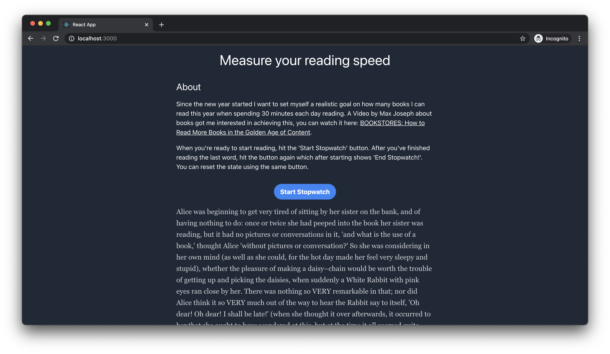

# Purpose

Since the new year started I want to set myself a realistic goal on how many books I can read this year when spending 30 minutes each day reading. A Video by Max Joseph about books got me interested in achieving this, you can watch it here: [BOOKSTORES: How to Read More Books in the Golden Age of Content](https://www.youtube.com/watch?v=lIW5jBrrsS0).

## Screenshot

